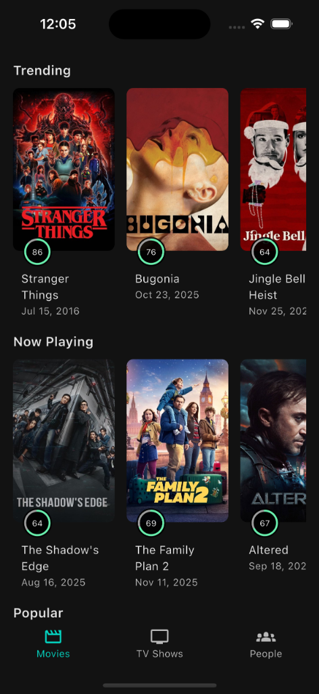
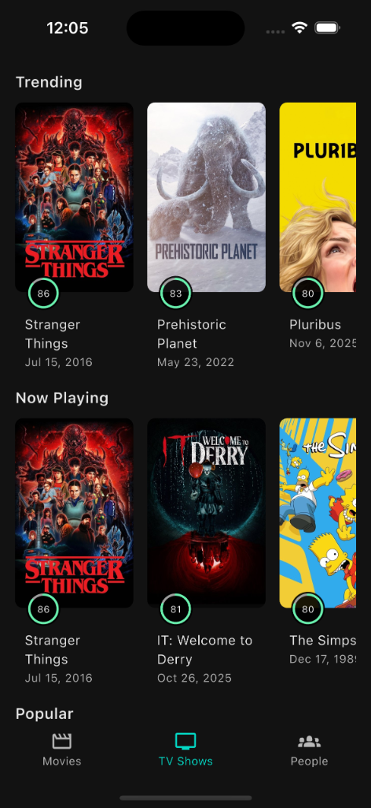
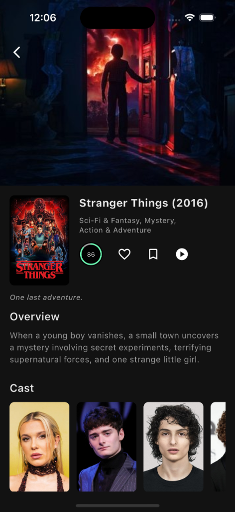
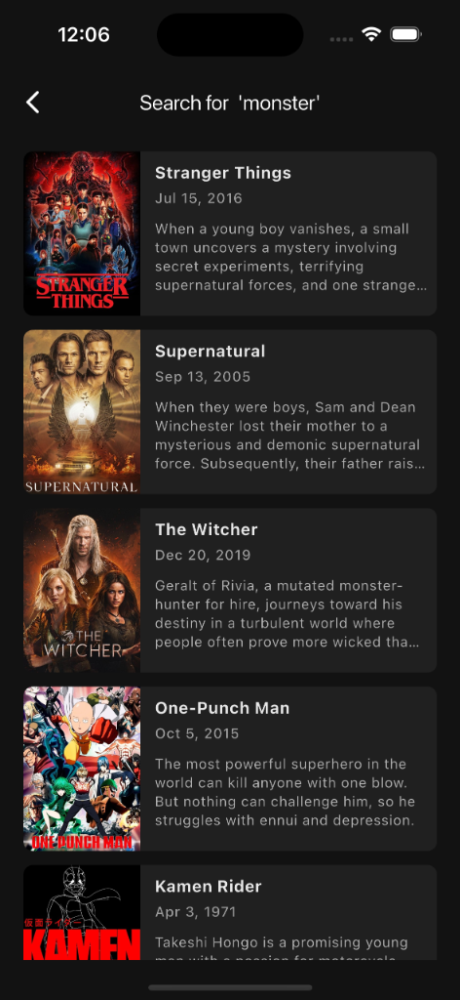

# Introducing My Show: Your Ultimate Movie & TV Companion

**My Show** is a premium mobile application designed to bring the vast world of cinema and television right to your fingertips. Built as a powerful alternative to IMDb and a mobile-first experience for The Movie Database (TMDB), My Show offers a sleek, immersive, and data-rich platform for entertainment enthusiasts.

## Experience Cinema Like Never Before

My Show isn't just a database; it's a curated experience. With a stunning dark-mode interface and fluid navigation, discovering your next favorite watch has never been more enjoyable.

### Key Features

*   **Trending & Popular**: Stay in the loop with real-time updates on what's trending globally. From the latest blockbusters to viral TV hits, our "Trending" and "Popular" sections ensure you never miss out on the conversation.
*   **Now Playing**: See what's currently hitting theaters and streaming platforms. Get instant access to release dates, ratings, and buzz.
*   **Comprehensive Details**: Dive deep into every title. Our detailed movie and TV show pages provide everything you need:
    *   **Overviews**: Compelling plot summaries.
    *   **Cast & Crew**: Explore the talent behind the magic.
    *   **Ratings**: Visual score indicators help you decide at a glance.
*   **Discover People**: Explore the careers of your favorite actors and actresses. Our "People" section features a beautiful grid layout of stars, connecting you to their filmographies.
*   **Powerful Search**: Looking for something specific? Our robust search engine lets you find movies, TV shows, and people instantly. Whether it's a specific title like "Stranger Things" or a thematic search like "monster," My Show delivers accurate and rich results.

## Designed for You

My Show combines the depth of a professional database with the elegance of a modern consumer app. Whether you're a casual viewer or a hardcore cinephile, My Show is your go-to destination for all things entertainment.

## Screenshots

| Movies | Tv Shows | Movie Details |
|:---:|:---:|:---:|
|  |  |  |

| Search | People | Profile |
|:---:|:---:|:---:|
|  |  |  |

---
